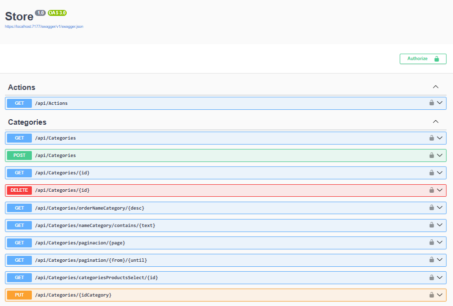
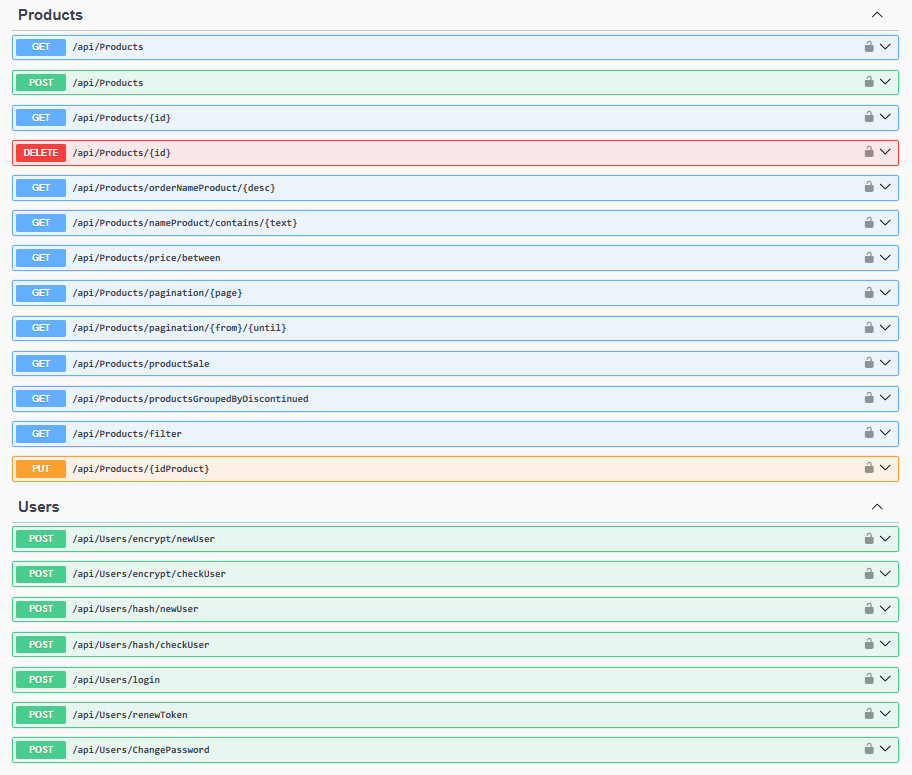

## Store_Sqlite
ASP.NET Core Web API Store





## Program
``` 
var connectionString = builder.Configuration.GetConnectionString("Connection");

builder.Services.AddDbContext<StoreContext>(options =>
    options.UseSqlite(connectionString);
);
``` 

## appsetting.Development.json
``` 
{
  "ConnectionStrings": {
    "Connection": "Data Source=store.db"
  }
}
``` 

[DeepWiki moraisLuismNet/Store_Sqlite](https://deepwiki.com/moraisLuismNet/Store_Sqlite)

